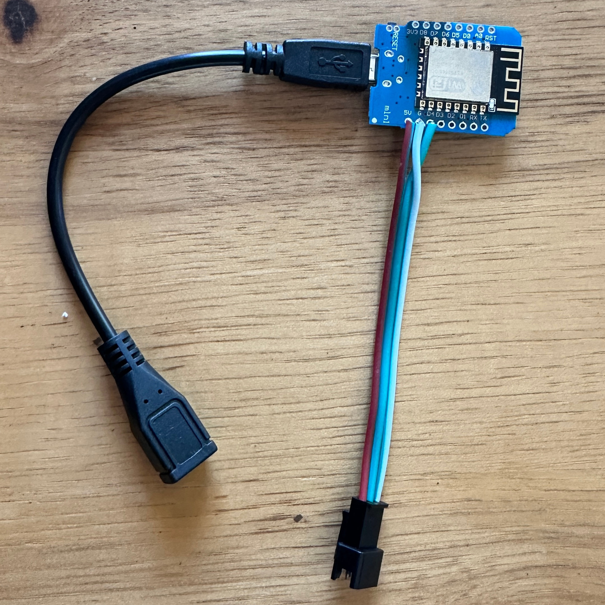
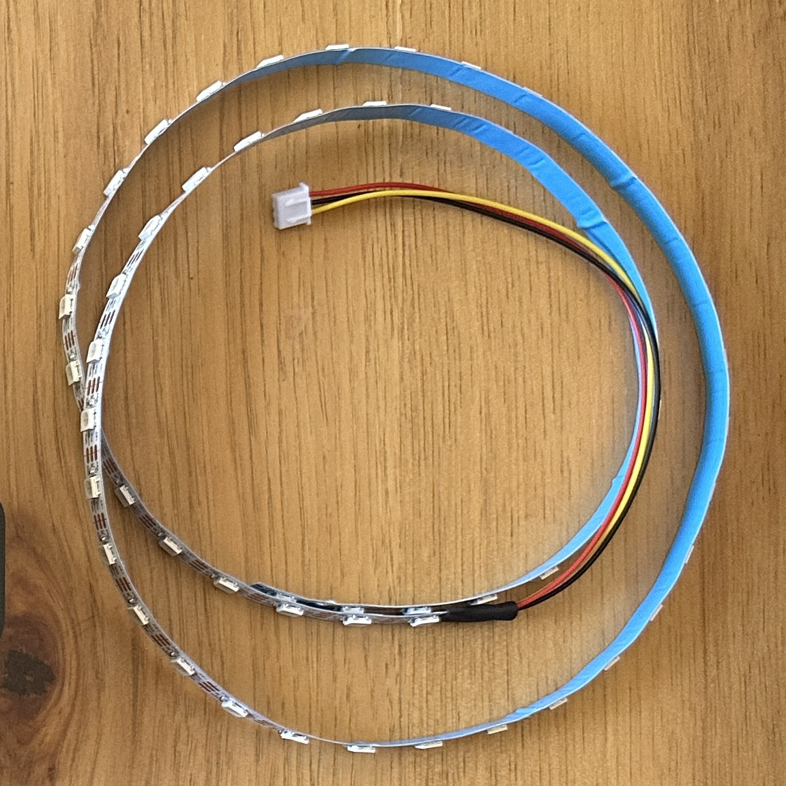

# Guide: Build Your Own 
The copilot lamp is fairly easy to assemble with a bit of soldering. The hardest part is patiently waiting for all the parts to print! 😉

In short, it is a few 3D printed parts, a microcontroller, some LEDs and a few wires to connect it all together.

## Prep Work and Sourcing Parts

### Materials
- Black PLA Filament [[US]](https://us.store.bambulab.com/products/pla-basic-filament?variant=41078274654344)
- White PLA Filament [[US]](https://us.store.bambulab.com/products/pla-basic-filament?variant=41078274687112)
- 60 LEDs (1 meter) - WS2812B Addressable LED Light Strip [[US]](https://www.amazon.com/dp/B097379J1V)
- ESP8266 Microcontroller micro-USB + WiFi [[US]](https://www.amazon.com/dp/B081PX9YFV)
- TTP223 Capacitive Touch Sensor [[US]](https://www.amazon.com/dp/B01D1D0FLG)
- Short Micro-USB Extension [[US]](https://www.amazon.com/dp/B0791ZZ3HG)
- (optional) Long micro-USB cable. [[US]](https://www.amazon.com/dp/B0CGDPS336)

### Optional Materials
If you would like to build yours a bit more professionally, you can use the following cables and sockets.
- JST Cable [[US]](https://www.amazon.com/dp/B0CF2BTYSK)
- JST Socket [[US]](https://www.amazon.com/dp/B0BMDZR7RZ)
- 3/8" Shrink Tubing [[US]](https://www.amazon.com/dp/B07FK17W6B)

### Tools
- Soldering Iron
- 3D Printer

> [!NOTE]
> **Tip:** Don't have a 3D printer? Check if your local library has a makerspace. They might be able to print the parts for you! 🤩

# Instructions
The lamp is designed to be assembled by hand, minus the small amount of soldering. It's printed with regular PLA filament on a printer with at least 200x200mm print area.

## 1. Print the parts
The .STL files for all of the printable parts are in the `/models` folder.

- No supports are required.
- For a textured look, consider a textured plate. [[US]](https://us.store.bambulab.com/products/bambu-dual-sided-textured-pei-plate)

> [!NOTE]  
> The backplate, faceplate, and eyes don't have to be black.
> Try printing them in another color or with fun multicolor or shiny filament! 🦄 🤩

| Image | Part | Description |
| -- | -- | -- |
 | LED Chamber | The part that glows, where the LEDs are attached. |
 | Electronics Plate | Sits inside the LED chamber for the microcontroller and cable management. |
 | Backplate | The back cover of the LED chamber. |
 | Faceplate | The outer shell for changing color. |
 | Eyes | Interchange eye inserts for the face of the LED chamber. |

## 1 Install Software
If you order the microcontrollers from the provided link, there
is a good chance that 1 of the 5 boards will be bad.
It's important to start with installing the software.

1. Connect the microcontroller to your computer using the USB cable.
1. Open a web browser and navigate to the [WLED install page](https://install.wled.me/).
1. Click the **Install** button and a window will appear.
Select the USB serial device.
1. Follow the instructions and wait a few minutes for the install.
    - If this seems to have trouble, try a different board.
1. When asked, enter your WiFi details.
    - Accessing the device locally is required to upload the configuration.
1. When the install is finished, click the **Visit Device** button.
1. On the device's main page, in the top right, click the **Config** button.
1. At the bottom, select **Security and Updates**
1. Scroll to the bottom and look for the backup options.
1. Install the presets using the `/wled-config/wled_presets` file.
This will do the following:
    - Install playlist 1 - Slow effects. (Single press action)
    - Install playlist 2 - Fast random effects. (Double press action)
    - Install preset 3 - LEDs off (Hold 2 seconds action)
1. Install the device configuration using the `wled-config/wled_presets_playlists.json` file.
This will do the following:
    - Set the device to use 60 LEDs and max 1 amp power.
    - Configure use of the touch sensor.
    - Assign the touch sensor to the playlists.
    - Configure a timer option to turn on the lamp at 9am and off at 5pm.
    - Clear the WiFi information.
    - Set it to broadst a WiFi network named `copilot-lamp` with default password `copilot-lamp`.
    
## 2 Pre Assembly and Testing

## Microcontroller
1. Attach the LED lead cable (socket side) to the microcontroller.
Make sure the cables come out of the side with the wifi module.
    - Red Wire: 5V (power)
    - White Wire: G (ground)
    - Green Wire: D7 (digital)

    
    

1. Attach the Touch Sensor lead cable (socket side) to the micrcontroller.
Make sure the cables come out of the side with the wifi module.
    - Red Wire: 3V3 (power)
    - White Wire: G (ground) - Note it is on the other side.
    - Green Wire: D7 (digital)

    [Missing pictures]

2. Attach the short micro-usb extension.

## LED Strip

1. Keeping the plug end, cut the 5 meter LED strip to 60 LEDs (1 meter).
    > [!WARNING]  
    > The ~1 meter length is more important than the 60 LEDS.
    > If the strip is too long it may not fit. If it is too short, then parts may not glow. 😕
    

## Pre-check Testing

1. Connect the LED strip and touch sensor to the microcontroller.
1. Plug in the USB cable to apply power.
1. The LEDs should randomly fade shades of green.

> [!NOTE]
> You must connect the touch sensor. If not, it will believe the touch sensor
is being held down and continuously attempt to turn of the LEDs.

